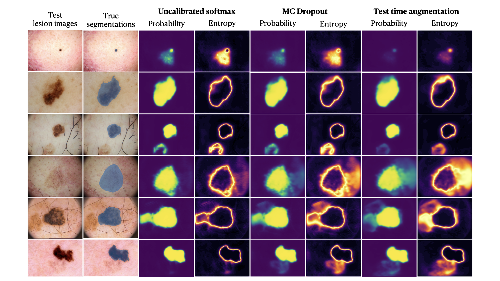

# UQ-Medical-Image-Segmentation

This repository provides a Monte Carlo UNet model for uncertainty quantification in the task of medical image segmentation.
This model has been coded using Pytorch. This code is a modified version of the original the original implementation of UNet model in Pytorch by milesial (https://github.com/milesial/Pytorch-UNet).
It consists of adding a dropout layer at the end of each convolution layer, which is used both during training and testing times.

## Dataset (2016 ISIC Challenge for Skin Lesion Segmentation)

The training dataset contains **900 dermoscopic lesion images** in JPEG format, along with the corresponding segmentation mask.

The ISIC Lesion segmentation dataset is originally introduced in the [ISIC Challenge webpage](https://challenge.isic-archive.com/), both training and testing dataset can be downloaded at [ISIC Challenge data](https://challenge.isic-archive.com/data/). 

The input images and target masks should be in the `data/imgs` and `data/masks` folders respectively (note that the `imgs` and `masks` folder should not contain any sub-folder or any other files, due to the greedy data-loader). You can use your own dataset as long as you make sure it is loaded properly in `utils/data_loading.py`.

## Model

We use a vanilla U-Net architecture. Inputs are resized to 128×128, the number of filters is halved relative to the original U-Net, and `padding=1` is applied to preserve spatial dimensions. A dropout layer (`p=0.2`) is appended to the end of each convolutional layer.

A pretrained model(`pretrained_model.pth`) is available for the ISIC dataset. 


## Results

For `epoch=20`, we have

- Mean Dice score on the test set: 0.889
- Median Dice score on the test set: 0.926

The result might further improve by increase the epoch number. Below please find example results for uncertainty quantification:


## Quick start
1. [Install CUDA](https://developer.nvidia.com/cuda-downloads)

2. [Install PyTorch 1.13 or later](https://pytorch.org/get-started/locally/)

3. Install dependencies
```bash
pip install -r requirements.txt
```
4. **[training]:** Download the training data (put them in `data/imgs` and `data/masks` folders respectively) and run training:
```bash
python train_bayesian.py --amp
```
5. **[predicting]:** Download the testing data (put them in `data/imgs_test` and `data/masks_test` folders respectively) and run predict (note that you need to change the `pretrained_model.pth` to the model you saved in the checkpoints):
```bash
python predict.py --input-dir ./data/imgs_test --output-dir ./data/masks_test_pred -m ./pretrained_model.pth
```
6. **[UQ]:** For each testing image (take image `imgs_test/ISIC_0000023.jpg` as an example):
```bash
python predict_bayesian.py -i ./data/imgs_test/ISIC_0000023.jpg -o ./data/test_uq/ISIC_0000023/ISIC_0000023.png --mc 20 --save-prob -m ./pretrained_model.pth
```

7. There are three methods to compute the **pixel-wise probabilities**

(a) Uncalibrated softmax UQ:
```bash
python predict_prob_direct.py --input-dir ./data/imgs_test --output-dir ./data/[folder name to save results] -m ./pretrained_model.pth
```

(b) MC dropout UQ:
```bash
python predict_prob_bayesian.py --input-dir ./data/imgs_test --output-dir ./data/[folder name to save results] -m ./pretrained_model.pth
```

(c) Test time augmentation (TTA) UQ:
```bash
python predict_prob_tta.py --input-dir ./data/imgs_test --output-dir ./data/[folder name to save results] -m ./pretrained_model.pth
```


Some example results can be found below



